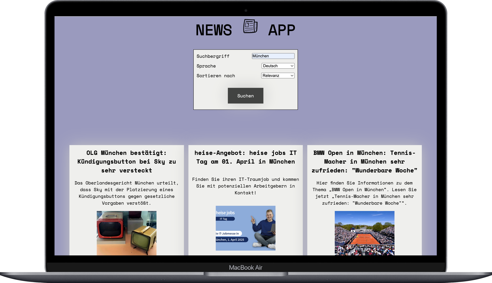
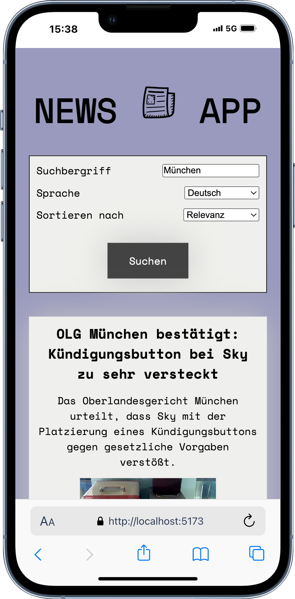
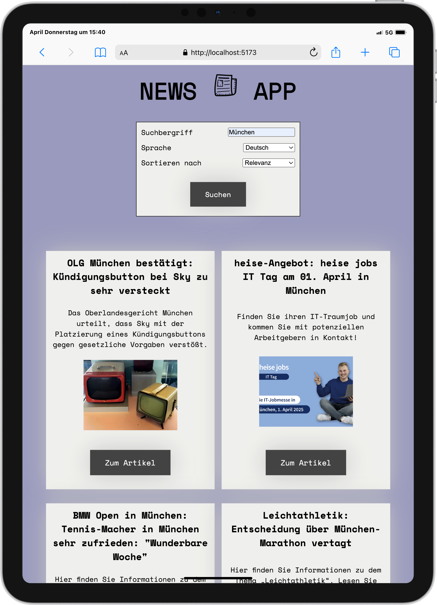

# NEWS APP



## Beschreibung

Dieses Projekt wurde im Rahmen eines Fullstack-Bootcamps in Zusammenarbeit mit einem Teamkollegen innerhalb eines Tages entwickelt. Wir verwendeten Visual Studio Code und bauten die App mit React.js, um Nachrichtenartikel dynamisch abzurufen und darzustellen. Das Ziel war es, die Integration einer externen API und die Verwaltung von Zustand in einer React-Anwendung zu üben.

NEWS APP ist eine Nachrichtenanwendung, die es Benutzern ermöglicht, stets über die neuesten Nachrichtenartikel aus verschiedenen Quellen informiert zu bleiben. Die App ist darauf ausgelegt, ein nahtloses und benutzerfreundliches Erlebnis beim Durchsuchen und Lesen von Nachrichten zu bieten. Das Ergebnis ist eine responsive News-Plattform, die es Nutzern ermöglicht, nach Kategorien gefilterte Nachrichten anzuzeigen.

## Funktionen

- Abrufen von Nachrichtenartikeln aus mehreren Quellen.
- Kategorisierte Nachrichten für eine einfache Navigation.
- Responsives Design für mobile und Desktop-Nutzer.
- Suchfunktion, um gezielt Artikel zu finden.

## Installation

1. Repository klonen:
    ```bash
    git clone https://github.com/MonaEis/News-App
    ```
2. In das Projektverzeichnis wechseln:
    ```bash
    cd News-App
    ```
3. Abhängigkeiten installieren:
    ```bash
    npm install
    ```
4. Entwicklungsserver starten:
    ```bash
    npm start
    ```

## Nutzung

- Öffne deinen Browser und navigiere zu `http://localhost:5173/News-App/`.
- Durchstöbere die neuesten Nachrichtenartikel.
- Nutze die Suchleiste, um gezielt nach Themen oder Artikeln zu suchen.
## Aktualisierter Tech-Stack

<div align="center">
    
    
    
    
    
</div>

<div style="display: flex; justify-content: space-between; align-items: center; width: 100%">
    
    
</div>

## Danksagungen

- Vielen Dank an die News API für die Bereitstellung der Daten.
- Inspiriert von modernen Nachrichtenanwendungen in Design und Funktionalität.
- Besonderer Dank gilt meine Teammitglied:
    [realmaxv](https://github.com/realmaxv)